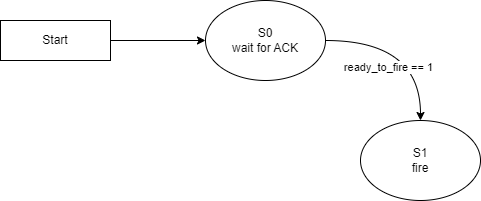
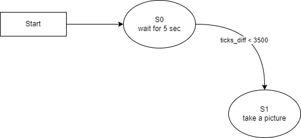

# ME 405 Term Project - The Glue Boys - Aotonomous Nerf Launcher with Target Lock on

## Sofware Description

### Classes
#### closedLoop
- This class can used to create an object to do a close-loop control. This is a P controller.
#### Encoder
- This class is responsible for creating an object to interface with an encoder.
#### mlx_cam
- This class can be specifically used to create an MLX90640 thermal infrared camera driver.
#### MotorDriver
- This class can be used to create a motor driver.

### Files
#### main.py
- This file is a main file that runs a coorperative multitasking program.
#### mlx_cam.py
- This file contains an MLX_cam class used to interface with an MLX90640 thermal infrared camera and methods that can capture a thermal image and output as an ASCII image, ASCII art, or CSV file.

## Tasks and States
### Task 1
- It is to handle the panning motion of the system by percisely controlling a DC motor using a close-loop control. It consists of 3 state: 180 Degree Turn, Wait for Picture, and Aiming.
### Task 2
- It is responsible for pulling the Nerf gun's trigger at appropriate time. It has two states. State 0 is to wait for acknowledgement from task 1. State 1 is to control the trigger acuator.
### Task 3
- It is to take a thermal picture and calculate the setpoint that will be sent to task 1 to aim the gun. There are two states for this task. State 0 is to wait for 5 seconds, and state 1 is to take the picture and calculate the setpoint.

### Task and State Diagrams
#### Task Diagram

#### Task 1 - State Diagram

#### Task 2 - State Diagram

#### Task 3 - State Diagram
